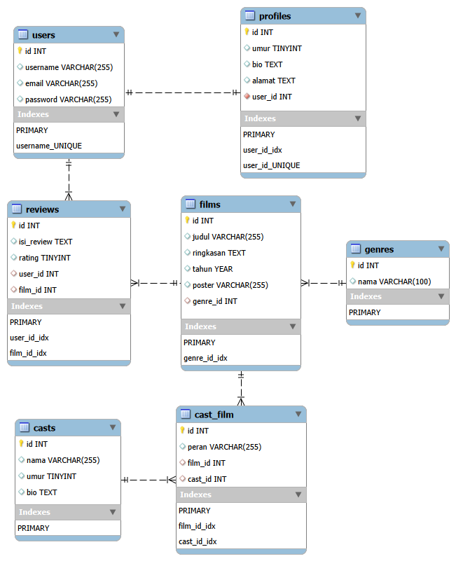

# 🎬 NontonApa - Final Project Aplikasi Review Film

**NontonApa** adalah aplikasi *review* film berbasis web yang dibuat menggunakan Laravel 12 sebagai *submission* Final Project.

Aplikasi ini memiliki dua "dunia":
1.  **Sisi Publik (Frontend):** Tempat *user* (tamu atau terdaftar) bisa "menjelajah" (discover) film, melihat detail, dan menulis ulasan (jika sudah *login*).
2.  **Sisi Admin (Backend):** Panel *dashboard* khusus untuk Admin mengelola semua data master (film, aktor, genre).

---

## 🚀 Link Demo Aplikasi

* **Link Video Demo:** `https://drive.google.com/file/d/1_J_LXUNUWh7wKHWNmNtkf6WXI3LXYr89/view?usp=drive_link`

---

## 📊 Entity Relationship Diagram (ERD)

Desain database aplikasi ini mengikuti relasi yang dinormalisasi untuk mengelola film, genre, aktor, dan ulasan.

**PENTING (Biar Gambar Ini Muncul):**
1.  Ubah nama *file* ERD kamu dari `ERD Aplikasi Review FIlm Update.png` jadi **`ERD.png`** (biar gampang & nggak ada spasi).
2.  Bikin *folder* baru di proyekmu namanya `docs` (di *root* proyek).
3.  Taruh *file* `ERD.png` itu ke dalem folder `docs/`.
4.  *Commit* & *Push* folder `docs/` itu ke GitHub.

---

## ✨ Fitur Utama

### 1. Frontend (Dunia Publik)
* Halaman **Detail Film** (menampilkan sinopsis, poster, genre, tahun, dan **daftar ulasan**).
* Halaman **Detail Aktor** (menampilkan bio dan **daftar film** yang dibintangi + perannya).
* Sistem Registrasi dan Login (Laravel Breeze).

### 2. Backend (Dunia Admin)
* Panel Admin terpisah (`/admin/...`) yang "digembok" (Admin Middleware).
* **CRUD `Films` :**
    * Validasi *client-side* (jQuery Validation) dan *server-side* (Laravel).
    * Fitur *upload* poster (menyimpan file ke *storage* dan menghapus file lama saat *update*).
    * Form untuk nambahin **Aktor + Peran** (Relasi Many-to-Many) pakai **jQuery Repeater**.
* **CRUD `Casts` (Aktor):** CRUD penuh dengan validasi.
* **CRUD `Genres`:** CRUD penuh dengan validasi.
* **Database Seeder & Factory:** Menggunakan *Seeder* untuk `Genres` (data asli) dan *Factory* untuk `Casts` (50+ data palsu).

### 3. Fitur Ulasan (CRUD User)
* *User* yang sudah *login* bisa **menulis ulasan** di Halaman Detail Film.
* Sistem validasi "anti-dobel" (1 *user* cuma bisa nulis 1 ulasan per film).
* *User* bisa **menghapus ulasan miliknya sendiri**.

---

## 🛠️ Teknologi & Paket yang Digunakan

* **Framework:** Laravel 12 (PHP 8.2)
* **Database:** MySQL
* **Template Backend:** AdminLTE 4
* **Template Frontend:** Bootstrap 5
* **Autentikasi:** Laravel Breeze
* **Paket/Library Tambahan:**
    1.  **DataTables:** 
    2.  **jQuery Validation:**
    3.  **jQuery Repeater:**
    4.  **SweetAlert2:** 
    5. **Bootstrap Star Rating**
